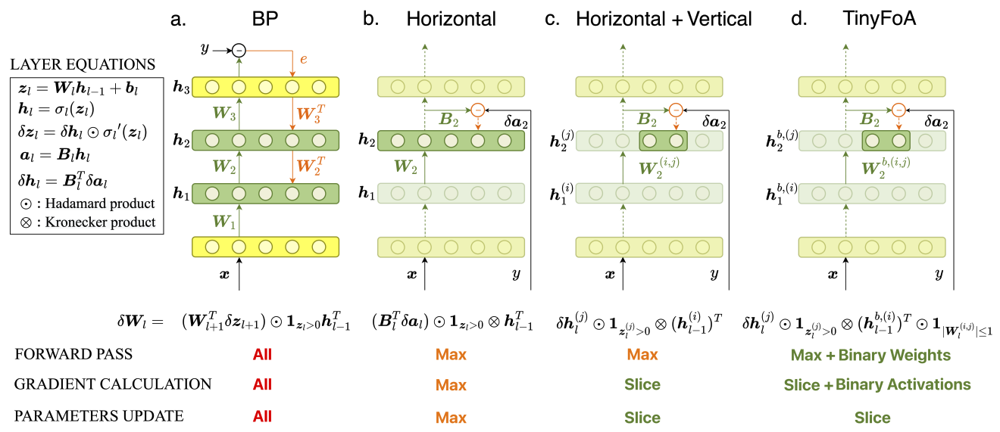

# TinyFoA: Memory Efficient Forward-Only Algorithm for On-Device Learning (Acccepted by AAAI 2025)

This repository provides the reproducible code for all the reported results in the paper **TinyFoA: Memory Efficient Forward-Only Algorithm for On-Device Learning**.



## 1. TinyFoA 
The codes for TinyFoA on MNIST, CIFAR-10, CIFAR-100, and [MIT-BIH](https://www.physionet.org/content/mitdb/1.0.0/) datastes are provided. 
Taking MNIST as an example, the codes are shown as follows:
- MNIST-TinyFoA_FC: ``python TinyFoA_FC.py ``
- MNIST-TinyFoA_LC: ``python TinyFoA_LC.py ``

> the parameters `dataset` need to be changed accordingly.

## 2. BP and Other Forward-Only Algorithms

The codes for BP and the state-of-the-art forward-only algorithms are provided, including DRTP<sup>[1]</sup>, PEPITA<sup>[2]</sup>, and FF<sup>[3]</sup> on MNIST, CIFAR-10, CIFAR-100, and [MIT-BIH](https://www.physionet.org/content/mitdb/1.0.0/) datastes. 

Taking CIFAR-10 as an example, the codes are shown as follows:
- CIFAR-10-DRTP+BW+BA: ``ppython Others/DRTP/main.py ``
- CIFAR-10-PEPITA+BW+BA: ``python Others/pepita.py ``
- CIFAR-10-FF+BW+BA: ``python Others/FF/main.py ``
- CIFAR-10-BP(FC)+BW+BA+V: ``python Others/BP_FC.py ``
- CIFAR-10-BP(LC)+BW+BA+V: ``python Others/BP_LC.py ``

> the parameters `dataset` need to be changed accordingly. We acknowledge the following repositories [DRTP](https://github.com/ChFrenkel/DirectRandomTargetProjection), [PEPITA](https://github.com/GiorgiaD/PEPITA) and [FF](https://github.com/loeweX/Forward-Forward).


[1] Frenkel, Charlotte, Martin Lefebvre, and David Bol. "Learning without feedback: Fixed random learning signals allow for feedforward training of deep neural networks." Frontiers in neuroscience 15 (2021): 629892.

[2] Dellaferrera, Giorgia, and Gabriel Kreiman. "Error-driven input modulation: solving the credit assignment problem without a backward pass." International Conference on Machine Learning. PMLR, 2022.

[3] Hinton, Geoffrey. "The forward-forward algorithm: Some preliminary investigations." arXiv preprint arXiv:2212.13345 (2022).

## Citation

```
@article{Huang_Aminifar_2025, 
    title={TinyFoA: Memory Efficient Forward-Only Algorithm for On-Device Learning}, 
    volume={39}, 
    url={https://ojs.aaai.org/index.php/AAAI/article/view/33910}, 
    DOI={10.1609/aaai.v39i16.33910}, 
    number={16}, 
    journal={Proceedings of the AAAI Conference on Artificial Intelligence}, 
    author={Huang, Baichuan and Aminifar, Amir}, 
    year={2025}, 
    month={Apr.}, 
    pages={17377-17385}
    }
```
